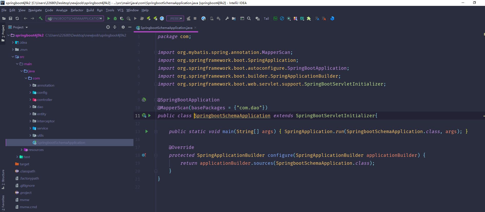
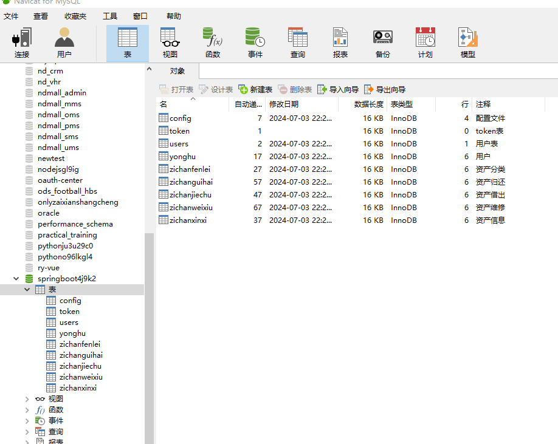
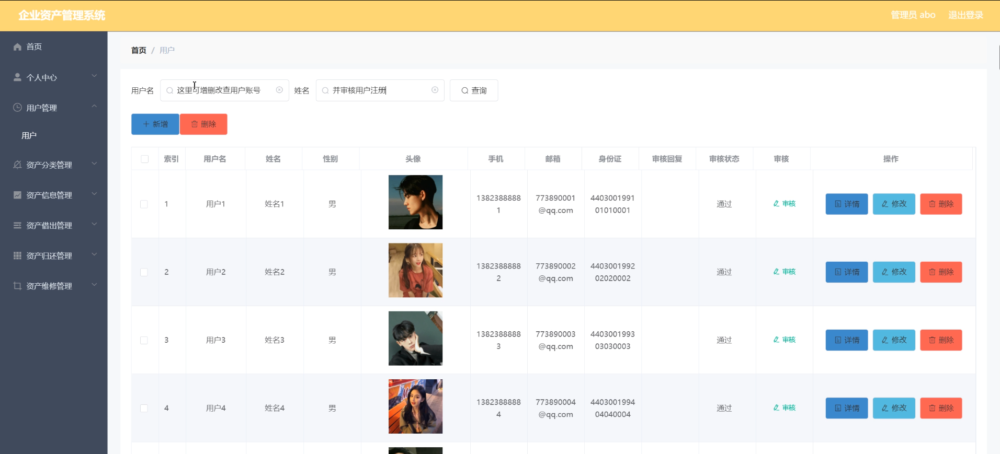
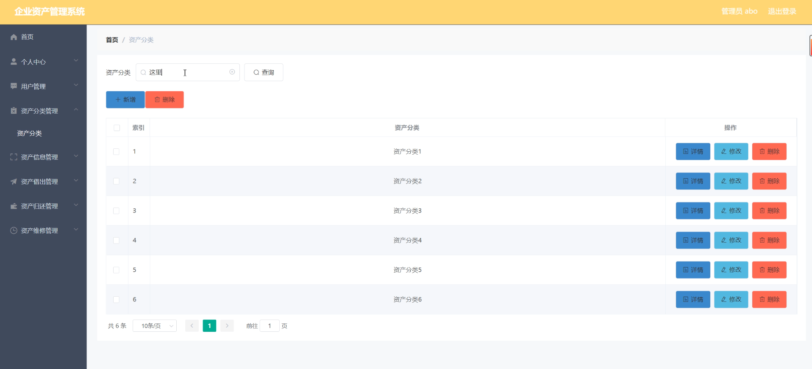
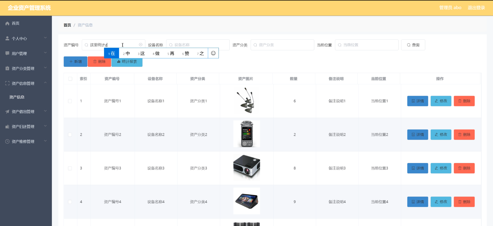
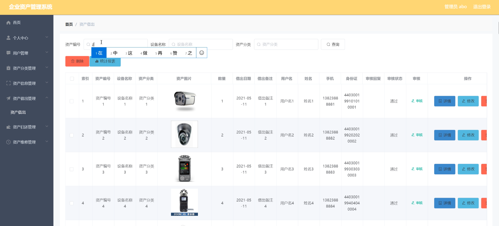
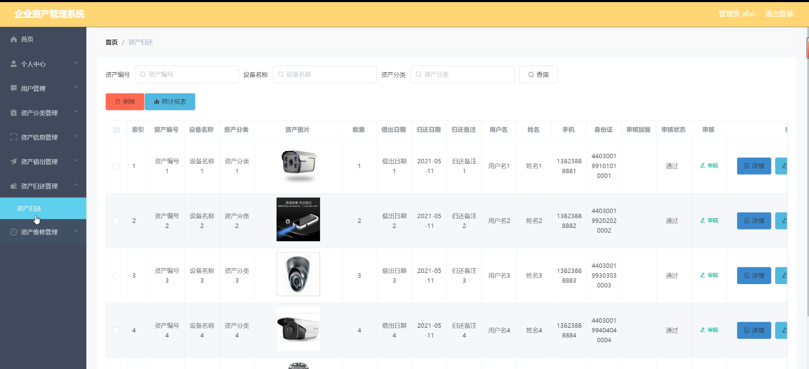
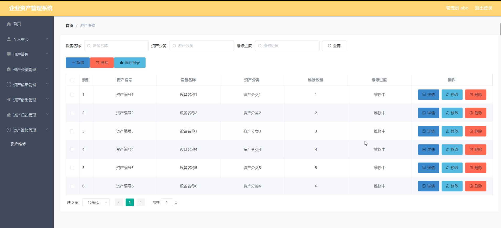
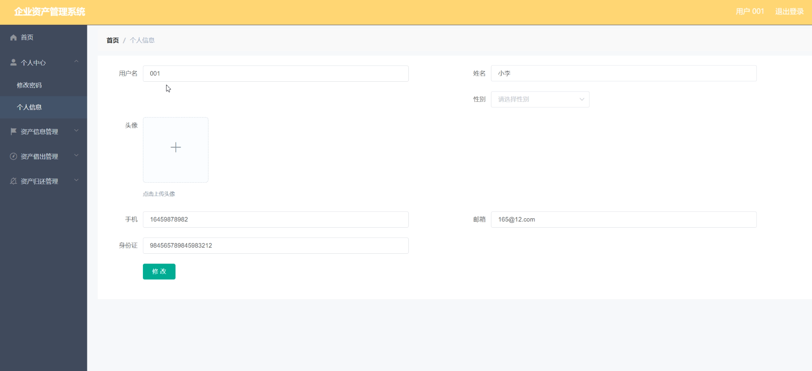
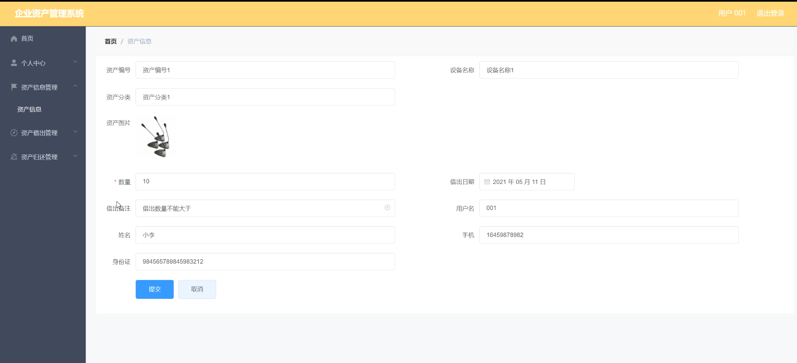

# 基于SpringBoot的企业资产管理系统

---
### 👉作者QQ ：1556708905 微信：zheng0123Long (支持定制修改、部署调试、定制毕设)

### 👉接网站建设、小程序、H5、APP、各种系统等

---

#### 介绍

在当今竞争激烈的商业环境中，有效的资产管理对于企业的运营和发展至关重要。基于 Spring Boot 开发的企业资产管理系统旨在为企业提供一个全面、高效、精确的资产管理解决方案，帮助企业实现资产的优化配置和最大化利用，降低运营成本，提高企业的竞争力。

#### 技术栈

后端技术栈：Springboot+Mysql+Maven

前端技术栈：Vue+Html+Css+Javascript+ElementUI

开发工具：Idea+Vscode+Navicate

#### 系统功能介绍

（一）管理员角色  
个人中心：管理员在此可以查看和修改个人的基本信息，设置个性化的工作界面和通知方式。  
用户管理：负责对系统用户进行添加、删除、修改和权限设置。可以根据不同用户的职责和需求，赋予相应的操作权限，确保系统的安全性和数据的保密性。  
资产分类管理：对企业资产进行分类定义，如固定资产、流动资产、无形资产等，并可进一步细分，如固定资产中的办公设备、生产设备等。通过清晰的分类，便于对资产进行统计、分析和管理。  
资产信息管理：全面录入和维护资产的详细信息，包括资产名称、型号、规格、购置日期、价值、存放地点、使用部门等。同时，支持对资产信息的查询、修改和删除操作，确保资产信息的准确性和及时性。  
资产借出管理：处理资产的借出申请，审核借出的必要性和合理性，记录借出的时间、借用人、预计归还时间等信息，并在借出期间对资产进行跟踪和监控。  
资产归还管理：当资产归还时，管理员进行验收和检查，确认资产的完好性。如果有损坏或缺失，按照规定进行处理，并更新资产的状态和相关信息。  
资产维修管理：对需要维修的资产进行登记，安排维修任务，跟踪维修进度，记录维修费用和维修结果，确保资产能够及时恢复正常使用。  

（二）用户角色  
个人中心：用户可以查看和修改个人资料，了解自己在系统中的操作记录和权限。  
资产信息管理：查询资产的详细信息，了解资产的基本情况和使用状态。  
资产借出管理：提出资产借出申请，填写相关信息，如借出原因、使用时间等，并按照规定的流程等待审批。  
资产归还管理：在资产使用完毕后，及时进行归还操作，确保资产能够及时回到可用状态。  

#### 系统作用
 
提高资产管理效率  
自动化和规范化的资产管理流程，减少了人工操作和数据录入的错误，大大提高了工作效率。  
增强资产的安全性和可控性  
严格的借出和归还管理，以及维修跟踪，确保资产不被滥用、丢失或损坏，保障了企业资产的安全。  
优化资产配置  
通过对资产信息的全面掌握和分析，企业可以更合理地配置资产，提高资产的利用率，降低闲置率。  
降低运营成本  
及时的维修管理和有效的资产利用，延长了资产的使用寿命，减少了不必要的资产购置，从而降低了企业的运营成本。  
提供决策支持  
系统生成的资产报表和分析数据，为企业的管理层提供了决策依据，有助于制定更科学的资产投资和管理策略。  

#### 系统功能截图

代码结构

数据库表

登录

用户管理

资产分类管理

资产信息管理

资产借出管理

资产归还管理

资产维修管理

用户端个人信息

资产信息

#### 总结

基于 Spring Boot 的企业资产管理系统通过明确的角色分工和丰富的功能模块，实现了对企业资产的全生命周期管理。它不仅提升了企业资产管理的水平和效率，还为企业的稳定发展和持续创新提供了有力的支持。未来，随着企业业务的拓展和技术的进步，该系统将不断完善和升级，以更好地适应企业的发展需求。

#### 使用说明

创建数据库，执行数据库脚本 修改jdbc数据库连接参数 下载安装maven依赖jar 启动idea中的springboot项目

后台地址
http://localhost:8080/springboot4j9k2/admin/dist/index.html

管理员  abo 密码 abo